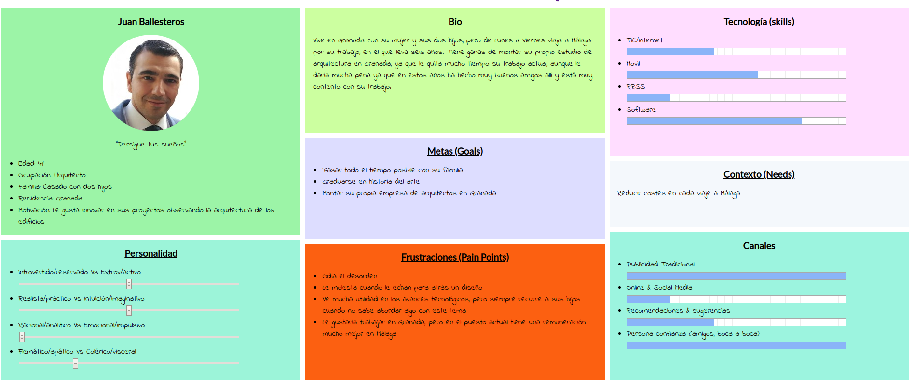
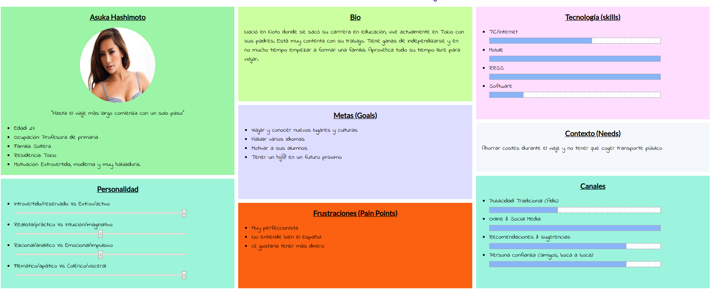
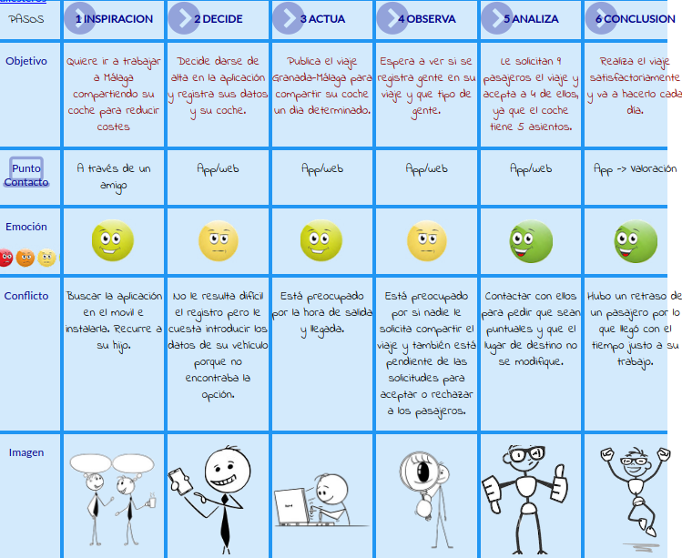
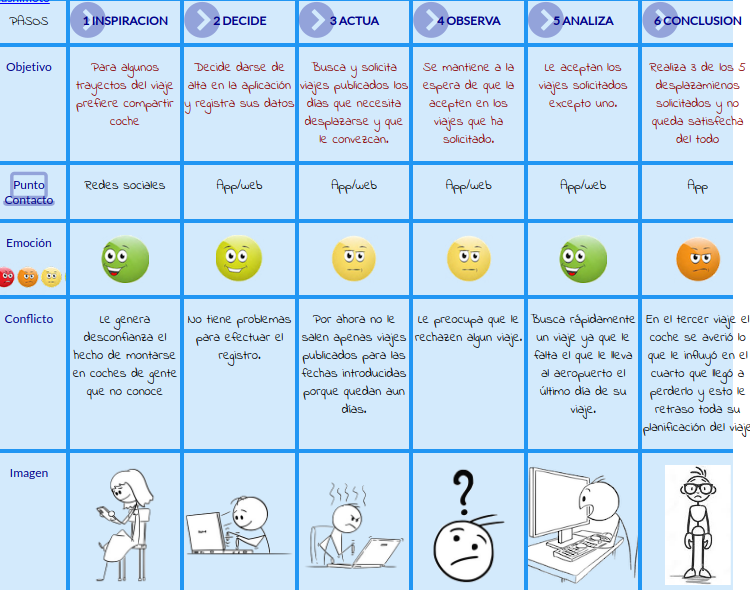

## Paso 1. UX Desk Research & Analisis

 1.a Competitive Analysis
-----

>>> Nuestro objetivo consiste en crear una plataforma para compartir viajes. Hemos tomado como referencia Amovens, por un lado, porque es una de las plataformas más usadas para compartir viaje, y por otro, por su cuidado diseño, sencillo y muy claro y por sus múltiples funciones que otras plataformas no incluyen, con la idea de seleccionar lo mejor de dicha plataforma, cambiar las partes más deficientes y añadir nuevas funcionalidades. 

 1.b Persona
-----

>>> Como partimos de la base de mejorar Amovens, decidimos hacer entrevistas a distintos tipos de usuarios, para valorar los aspectos positivos y negativos de Amovens. Entre otros, hemos escogido a Juan y Asuka porque pensamos que la edad, el sexo, la cultura u otros factores pueden ser muy determinantes a la hora de interactuar con dicha plataforma.

 1.c User Journey Map
----

>>> Muy en línea con lo comentado en el punto anterior, pensamos que la forma en la que interactúan con la aplicación toma caminos muy distintos, ofreciéndonos un enfoque más amplio al que tendríamos si pensamos en cómo usaría la aplicación alguien como nosotros.

 1.d Usability Review
----
>>> Después de las entrevistas, decidimos comprobar el funcionamiento y la usabilidad de Amovens,  comprobando sus virtudes y defectos. Para ello, elaboramos un documento de revisión de la usabilidad.
>>> - Enlace al documento:  
>>> - Valoración final (numérica): 86
>>> - Comentario sobre la valoración:  La nota obtenida en la revisión de usabilidad es 86 puntos, lo que la sitúa como una página realmente buena, que no le falta mucho para ser casi perfecta. Los puntos más críticos que encontramos han sido por ejemplo los mensajes de error, es decir, cuando en un formulario tienes que rellenar diferentes campos, si alguno no lo rellenas y es obligatorio, no te lo especifica claramente; por otro lado hay carencia de ayuda o instrucciones a la hora de realizar registros o publicar; y otro punto débil a señalar es que si el usuario que utiliza la plataforma es una persona mayor, no es lo mismo que una persona joven que está más habituada a la tecnología, y es aquí donde la ayuda entra en juego, ya que dicha plataforma es igual para todos los usuarios.

[1.e Memoria](./Memoria.pdf)
----
