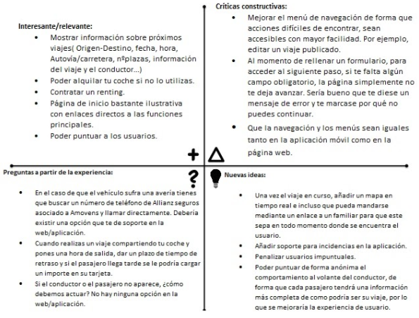
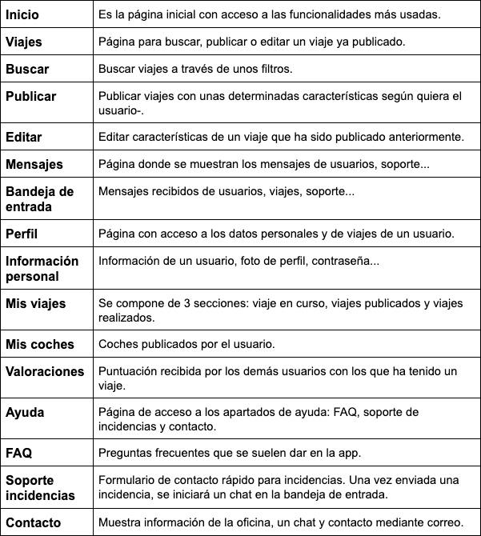
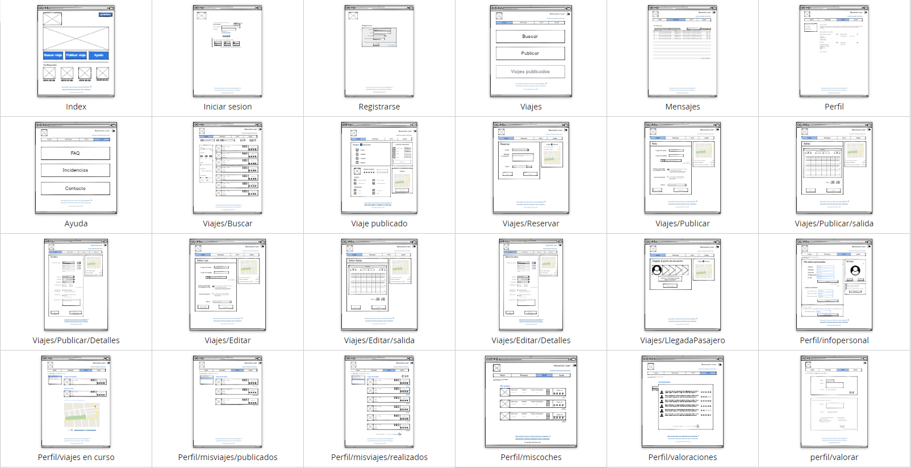

## Paso 2. UX Design  

 2.a Feedback Capture Grid
----
>>> Una vez realizadas las entrevistas, habiendo realizado la revisión de usabilidad y añadiendo nuestro propio enfoque, hemos clasificado los aciertos y errores de la plataforma.

>>> Además, hemos querido remodelar el diseño aportando más claridad en general y dando más importancia a algunos elementos que no la tenían, como es el añadido de varias secciones que aportan funcionalidades importantes y que no estaban implementadas (secciones que detallaremos más adelante).

 2.b Tasks & Sitemap
-----
>>> Una vez planteadas las ideas a desarrollar recogidas de la experiencias de los usuarios y de las mejoras que queremos implementar, clasificamos las tareas principales de la plataforma y su grado de utilización según distintos perfiles de usuario.

>>> Una vez clasificadas las tareas principales decidimos desarrollar el mapa web de la plataforma para su posterior implementación. En este punto, tuvimos en cuenta la dificultad para acceder a algunos menús y opciones en Amovens, con la idea de mejorar la experiencia de usuario.

 2.c Labelling
----
>>> Después de realizar el mapa del sitio, destacamos la funcionalidad de cada página: 

 2.d Wireframes
-----
>>> Desarrollado el mapa web de la plataforma, decidimos llevar a cabo el diseño de los wireframes, con las ideas de mejora implementadas, destacando la simplicidad de los menús o las nuevas funciones. 

Para verlos con más detalle pulse en este enlace: 

[2.e Documentación propuesta](./Documentación_de_propuesta.pdf)
----
