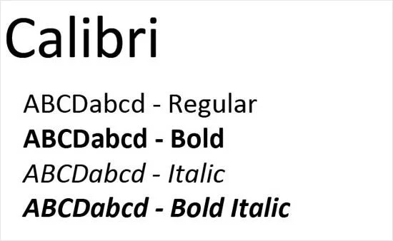

## Paso 3. Mi equipo UX-Case Study

 3.a ¿Como se cuenta un UX-Case Study?
-----

>>> - Realizados los bocetos, analizamos un caso de estudio de una aplicación, [Musemap](https://blog.prototypr.io/musemap-street-art-app-ux-case-study-9bec6a99823b), entra las cosas que nos llamó bastante la atención fué:
>>> - Lo primero ha sido emplear la técnica de brainstorming, para poder identificar las necesidades de los posibles usuarios objetivo. De esta forma además, se consigue que los desarrolladores tengan una visión global del futuro proyecto.
>>> - Las pruebas de usabilidad en los diseños de papel nos parecen un factor importante ya que corrigen los primeros problemas de diseño en cuanto a funcionalidad o incluso pueden llevar a rehacer de cero el prototipo.
>>> - Otro detalle a tener en cuenta es la pizarra de “features”, con la cual, los desarrolladores pueden priorizar las tareas en función del esfuerzo/coste y la necesidad de realizarlas.
>>> - Y por último los planes futuros hay que tenerlo en cuenta, porque una aplicación para que siempre funcione bien necesita un mantenimiento diario y a menudo actualizaciones con novedades.
>>> - Creemos que es necesario añadir pruebas de testeo una vez tenemos la maqueta final, pues pueden existir detalles a cambiar, como podría ser la paleta de colores.

  3.b Logotipo
----
>>> Como todas las plataformas o páginas, no podía faltar un logotipo que identifique a la nuestra. Es importante que el logotipo sea llamativo para que sea fácil de identificar. Ha sido realizado con la herramienta gratuita [Canva](https://www.canva.com/). Hemos empleado estos colores porque pensamos que atraen la atención del usuario y realizan buen contraste entre ellos, aparte salen dos coches alrededor de un círculo como si de un trayecto se tratase, que identifican el objetivo de nuestra plataforma, el compartir viajes. La elección del logotipo está pensada también para que este sea adaptable a cualquier plataforma, tamaño o formato.

 3.c Guidelines
----
>>> Revisando los patrones de diseño y guidelines nos dimos cuenta que en los wireframes nos faltaban algunos bastante importantes como:
>>> - Barra de progreso para cuando se está publicando un viaje saber en qué etapa está.
>>> - Permitir ver y filtrar las opiniones de los usuarios.
>>> - Permitir que el usuario pueda agregar y administrar fácilmente los métodos de pago.
>>> - Poder autentificarse en la aplicación mediante huella y no tener que introducir contraseña cada vez que se inicia sesión.
>>> - Solicite permisos en un contexto relevante.(ejemplo ubicación o cámara)
>>> - Permita realizar transiciones entre las aplicaciones para dispositivos móviles y la Web móvil sin inconvenientes.
>>> - Tambíen revisando nuestra plataforma y diferentes diseños llegamos a la conclusión de que es importante tener una tipografía clara y que se diferencie bien del fondo y demás elementos de la página.

### Tipografía Calibri:

>>> - Hemos elegido Calibri ya que es de las más exitosas para el diseño web. Sus trazos curvos y elegantes fueron pensados para su uso en pantalla; genera gran impacto tanto en tamaños grandes como en pequeños. 

### Nuestra paleta de colores:

>>> - Respecto a los colores, el diseño de estos es importante, la página debe ser llamativa y que atraiga a la gente. Una buena página de inicio es principal para llamar la atención de los clientes. Es importante no tener mucha variedad de colores que no saturen la vista del usuario, nuestra paleta de colores principales está basada en el logotipo, como son el negro para la tipografía, el azul para ítems/menús seleccionados, el amarillo para las valoraciones y el rojo para mensajes de error o alertas, estos patrones de colores juegan buena combinación y al mismo tiempo hacen que la página sea clara, llamativa y guste al cliente.

### Nuestros iconos:

>>> - Nuestra selección de iconos se ha basado en la simplicidad, pero al mismo tiempo que sean fácimente comprensibles y reconocibles.

>>> - Para verlos en más detalle: 

  3.d Video
----

3.e Conclusión final
----
>>> Nuestra valoración final del proceso de desarrollo de la práctica ha sido bastante satisfactoria. Nos hemos enfocado más en el diseño de la experiencia de usuario cuando normalmente en toda la carrera estamos acostumbrados a un diseño más técnico en el que no se tiene en cuenta al usuario, sino solamente la visión del programador.

>>> Hemos utilizado técnicas bastante importantes y que hasta ahora no sabíamos, como son las Personas Ficticias, los Journey Maps, los Usability Review, el Feedback Capture Grid, entre otros. Gracias a esto hemos podido diseñar un producto intuitivo, accesible y funcional.

>>> En cuanto al diseño, creemos que hemos elaborado una buena plataforma que facilita bastante la experiencia del usuario, gracias a elementos como son el sitemap, el labelling y la elaboración de wireframes.

>>> En resumen, hemos aprendido buenas técnicas de desarrollo software enfocadas en la experiencia de usuario que antes no conocíamos.

