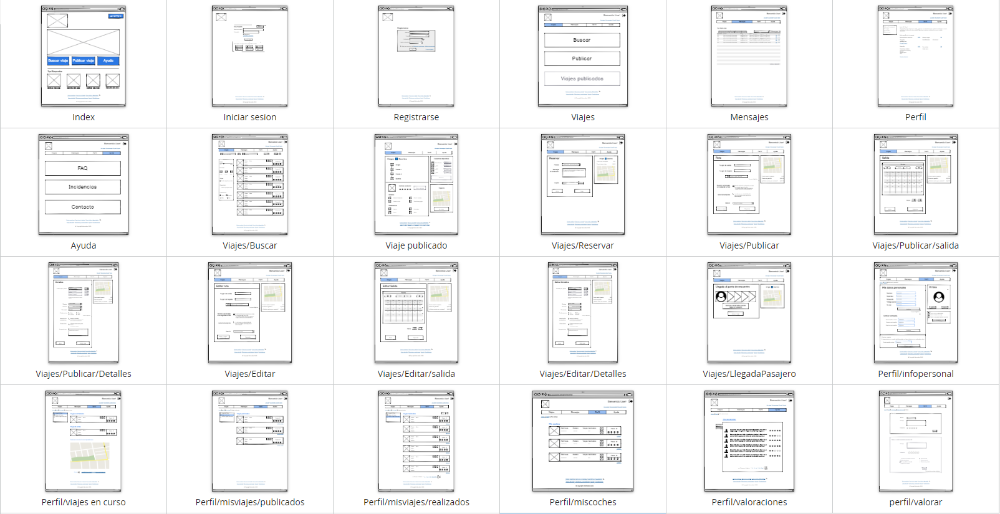
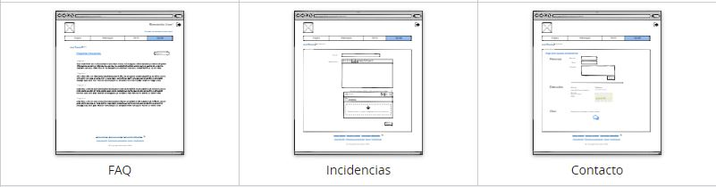
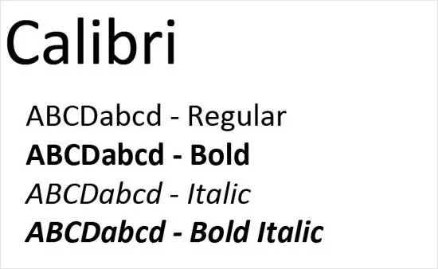
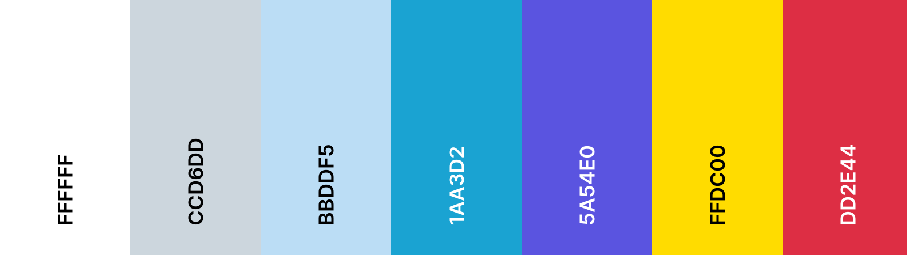
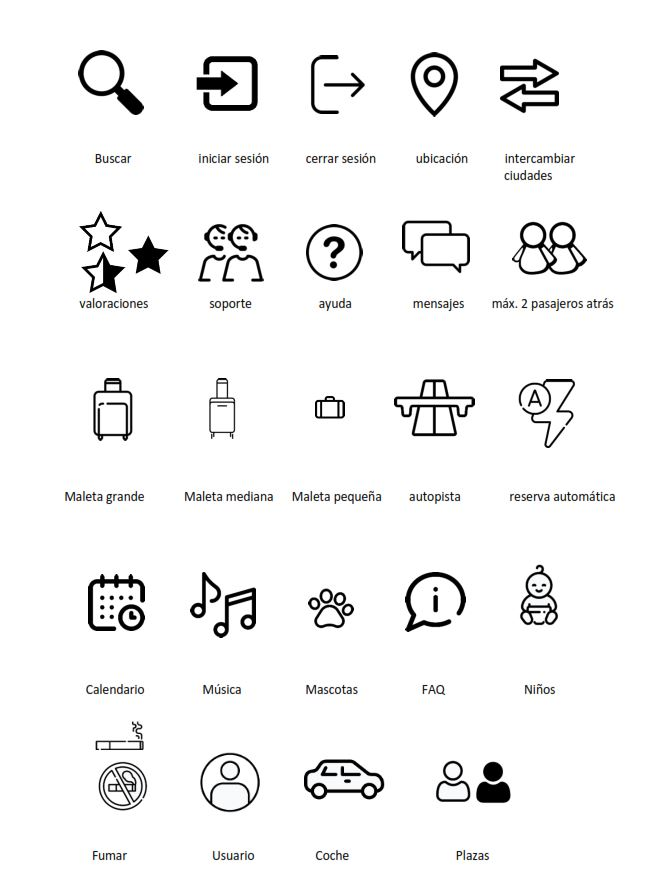
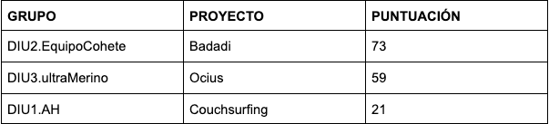

# DIU20
Prácticas Diseño Interfaces de Usuario 2019-20 (Economía Colaborativa)

Grupo: DIU1_3EdfYa.  Curso: 2019/20

Proyecto: GoCar

Descripción: Plataforma para compartir viajes.

Logotipo:


Miembros
 * :bust_in_silhouette:  Manuel Mesas Gutiérrez    :octocat:     
 * :bust_in_silhouette:  Carlos Toledano Delgado :octocat:

-----

# Proceso de Diseño

## Paso 1. UX Desk Research & Analisis

 1.a Competitive Analysis
-----

>>> Nuestro objetivo consiste en crear una plataforma para compartir viajes. Hemos tomado como referencia Amovens, por un lado, porque es una de las plataformas más usadas para compartir viaje, y por otro, por su cuidado diseño, sencillo y muy claro y por sus múltiples funciones que otras plataformas no incluyen, con la idea de seleccionar lo mejor de dicha plataforma, cambiar las partes más deficientes y añadir nuevas funcionalidades. 


 1.b Persona
-----

>>> Como partimos de la base de mejorar Amovens, decidimos hacer entrevistas a distintos tipos de usuarios, para valorar los aspectos positivos y negativos de Amovens. 


 1.c User Journey Map
----

>>> Muy en línea con lo comentado en el punto anterior, pensamos que la forma en la que interactúan con la aplicación toma caminos muy distintos, ofreciéndonos un enfoque más amplio al que tendríamos si pensamos en cómo usaría la aplicación alguien como nosotros.


 1.d Usability Review
----
>>> Después de las entrevistas, decidimos comprobar el funcionamiento y la usabilidad de Amovens,  comprobando sus virtudes y defectos. Para ello, elaboramos un documento de revisión de la usabilidad.
>>> - Enlace al documento:  
>>> - Valoración final (numérica): 86
>>> - Comentario sobre la valoración:  La nota obtenida en la revisión de usabilidad es 86 puntos, lo que la sitúa como una página realmente buena, que no le falta mucho para ser casi perfecta.

----
>>> Para más información sobre el paso 1, pulse aquí: 
----

## Paso 2. UX Design  


 2.a Feedback Capture Grid
----
>>> Una vez realizadas las entrevistas, habiendo realizado la revisión de usabilidad y añadiendo nuestro propio enfoque, hemos clasificado los aciertos y errores de la plataforma.


>>> Además, hemos querido remodelar el diseño aportando más claridad en general y dando más importancia a algunos elementos que no la tenían, como es el añadido de varias secciones que aportan funcionalidades importantes y que no estaban implementadas (secciones que detallaremos más adelante).


 2.b Tasks & Sitemap
-----
>>> Una vez planteadas las ideas a desarrollar recogidas de la experiencias de los usuarios y de las mejoras que queremos implementar, clasificamos las tareas principales de la plataforma y su grado de utilización según distintos perfiles de usuario.


>>> Una vez clasificadas las tareas principales decidimos desarrollar el mapa web de la plataforma para su posterior implementación.


 2.c Labelling
----
>>> Después de realizar el mapa del sitio, destacamos la funcionalidad de cada página: 


 2.d Wireframes
-----
>>> Desarrollado el mapa web de la plataforma, decidimos llevar a cabo el diseño de los wireframes, con las ideas de mejora implementadas, destacando la simplicidad de los menús o las nuevas funciones. 





----
>>> Para más información sobre el paso 2, pulse aquí: 
----

## Paso 3. Mi equipo UX-Case Study

 3.a ¿Como se cuenta un UX-Case Study?
-----

>>> - Realizados los bocetos, analizamos un caso de estudio de una aplicación, [Musemap](https://blog.prototypr.io/musemap-street-art-app-ux-case-study-9bec6a99823b), lo que más nos llamó la atención fueron, entre otras, las siguientes:
>>> - La técnica de brainstorming.
>>> - Las pruebas de usabilidad en los diseños de papel.
>>> - La pizarra de “features”.

  3.b Logotipo
----
>>> Como todas las plataformas o páginas, no podía faltar un logotipo que identifique a la nuestra. Es importante que el logotipo sea llamativo para que sea fácil de identificar. Ha sido realizado con la herramienta gratuita [Canva](https://www.canva.com/).


 3.c Guidelines
----
>>> Revisando los patrones de diseño y guidelines nos dimos cuenta que en los wireframes nos faltaban algunos bastante importantes:

>>> - Respecto a la tipografía hemos elegido Calibri ya que está pensada para su uso en pantalla.



>>> - Respecto a la paleta de colores, éstos deben ser llamativos y que atraigan a la gente, sin saturar la vista. Por eso hemos elegido una paleta de colores pastel.



>>> - Nuestra selección de iconos se ha basado en la simplicidad, pero al mismo tiempo que sean fácilmente comprensibles y reconocibles.



  3.d Video
----

>>> [Vídeo GoCar](https://drive.google.com/file/d/1dU2-6EOmq3W4CH8C0_J7XcbQP1Xvgw79/preview)

----
>>> Para más información sobre el paso 3, pulse aquí: 
----


## Paso 4. Evaluación 


 4.a Casos asignados
----


>>> Descripción de las asignaciones (3 UX Case Study) y enlace a  sus repositorios.

>>>> En la seccioón P4/readme.md se debe acceder además a sus respectivas hojas de evaluación y conclusiones 


 4.b User Testing
----

>>> Seleccione a una de sus personas ficticias. Exprese las ideas de posibles situaciones conflictivas de esa persona en las propuestas evaluadas


## Paso 4. Evaluación 


 4.a Casos asignados
----

### Caso 1: [Repositorio 1](https://github.com/antoniohenriques/DIU20).

>>> Plataforma basada en Couchsurfing.
[Review proyecto 1](./P4/DIU1.AH_review.xls).

### Caso 2: [Repositorio 2](https://github.com/Leamsy/DIU20).

>>> Badadi es un proyecto basado en la web Badi, es una web para alquilar habitaciones o apartamentos, el objetivo de este proyecto es mejorar dicha web, Badi.
[Review proyecto 2](./P4/DIU2.EquipoCohete_review.xls).

### Caso 3: [Repositorio 3](https://github.com/merino25/DIU20).

>>> Ocius es un proyecto basado en la página Artery, es una aplicación para dispositivos móviles para crear eventos de ocio en las casas de los usuarios o que estos asistan a eventos de los demás.
[Review proyecto 3](./P4/DIU3.ultramerino_review.xls).

 4.b User Testing
----

>>> Para elaborar la experiencia de usuario en estos proyectos hemos seleccionado a Asuka Hashimoto.


### Experiencia 1
>>> Para esta  experiencia, debido a que el proyecto tiene el README casi vacío y dice basarse en couchsurfing, hemos decidido usar esta plataforma
`````
Asuka está buscando alojamiento en Nueva York, pero buscando habitaciones de hoteles, camas de hostal 
o Airbnbs, se encuentra precios demasiado elevados que no se puede permitir. Por ello decide recurrir 
a couchsurfing. Se crea su perfil y busca alojamiento. Se pone en contacto con varias personas. Asuka 
se enfada mucho porque algunos de los que ofrecen alojamiento quieren ligar con ella. Finalmente Asuka 
consigue encontrar un sitio donde dormir, pero le gustaría que hubiese algún tipo de herramienta con la 
que pudiera evitar el mal rato que ha pasado.
`````

### Experiencia 2
`````
Asuka viaja a Buenos Aires, donde pasará 6 meses para aprender Español. Decide buscar apartamento para 
compartir en Badadi. Una vez que encuentra uno que le agrada, y que está muy cuidado y disponible en sus 
fechas, decide reservarlo. El problema llega cuando Asuka llega al apartamento y se encuentra con que 
las fotos publicadas en la plataforma no se corresponden con la realidad. El estado del apartamento deja 
mucho que desear y la limpieza entre sus compañeros es escasa. A Asuka le hubiese gustado que el 
apartamento estuviese como en las fotos que ella vió y le gustaría que por ejemplo hubiese en la 
plataforma una restricción que obligase a actualizar cada cierto tiempo las fotos de los 
apartamentos/habitaciones, o bien, que en el buscador hubiese un filtro con las fotos más recientes.
`````

### Experiencia 3
`````
Asuka ha vuelto a Japón y ha pensado en celebrarlo a lo grande. Para ello decide organizar una fiesta 
en su casa a través de Ocius. No tiene ningún problema publicando el evento en la plataforma. Manda un 
link a todos sus amigos y conocidos, a parte de las personas que quieran unirse al evento a través de la 
aplicación hasta llenar el aforo. Durante el transcurso de la fiesta, la gente empieza a ser menos 
consciente de sus actos y terminan rompiéndole muchos objetos de la casa, e incluso se percata de que le 
han robado. Asuka ante esto, no sabe cómo actuar, ya que solo tiene el correo de estas personas. Aún 
así, decidió llamar a la policía. Asuka pensó que la plataforma debería obligar a tener más datos de los 
usuarios tales como su identificación, nombres y apellidos, aunque a estos datos solo tuviese acceso la 
plataforma y que esto solo pudiesen ser consultados por la policía.
`````


. 4.c Ranking 
----

>>> 

>>> Este ranking lo hemos obtenido de las evaluaciones realizadas a cada proyecto teniendo como resultado en primera posición a EquipoCohete con su proyecto Badadi destacando:
	
>>> Puntos fuertes:
>>> - Competitive Analysis: Da una explicación de las distintas alternativas y ofrece una tabla comparativa.
>>> - Site map y labelling: tiene un buen mapa del sitio y un labelling muy completo y añade iconos.
>>> - Logotipo: se identifica muy bien con el objetivo de la plataforma.

>>>  Puntos débiles:
>>> - Historia del UX Case Study: realiza un video muy pobre limitándose a leer su repositorio y no mostrar de forma justificada la idea de este producto.
>>> - Los readme del los repositorios de cada práctica se limitan solo a compartir los archivos de cada práctica sin apenas explicación.
>>> - Los bocetos no son coherentes con el sitemap y no queda claro que muestren las tareas más importantes.

>>> En segunda posición tenemos a Ultramerino destacando de su proyecto Ocius:

>>> Puntos fuertes:
>>> - Readme principal: Tiene muy buena introducción en el readme principal del repositorio añadiendo también un logotipo de su equipo.
>>> - Journey map: El segundo journey map tiene una historia muy comprensible y nos muestra un problema de la plataforma que se podría solucionar con el nuevo diseño.
>>> - Feedback-capture-grid:  Es muy completo aunque no está disponible en su readme principal.

>>> Puntos débiles: 
>>> - Bocetos: son lamentables y sin apenas información, con solo tres bocetos. 
>>> - Competitive Analysis: no propone alternativas en su análisis competitivo con otras plataformas.
>>> - Historia del UX Case Study: realiza un video que no muestra apenas información sobre su proyecto y además no transmite una idea clara de porqué se ha elaborado dicho proyecto.


>>> Y por último, en tercera posición queda AH con su intento de proyecto de Couchsurfing:

>>> Puntos fuertes:
>>> - No tiene nada bueno destacable, entre todo lo malo tiene video de su proyecto y explicación de Musemap y un labelling muy sencillo.
>>> Puntos débiles:
>>> - Todo lo restante...

>>> Conclusión final:

>>> Eligiendo a nuestra persona ficticia, hemos obtenido algún conflicto en cada uno de los proyectos, lo cual significa que a pesar de que se han mejorado las plataformas iniciales, siempre habrá puntos débiles que se puedan mejorar. Por eso pensamos que es muy importante que una plataforma, una vez lanzada, siga actualizándose, mejorando sus características e implementando nuevas funciones, que la hagan líder en su mercado competitivo, no sólo desde la perspectiva técnica, sino de la perspectiva centrada en la experiencia de usuario.
