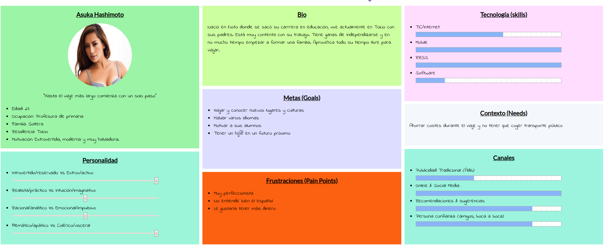
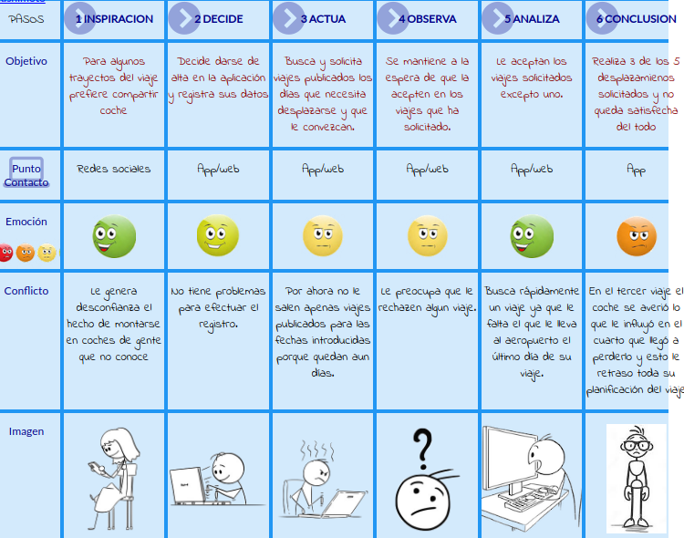

# DIU20
Prácticas Diseño Interfaces de Usuario 2019-20 (Economía Colaborativa)

Grupo: DIU1_3EdfYa.  Curso: 2019/20

Proyecto: GoCar

Descripción: Plataforma para compartir viajes.

Logotipo:

Miembros
 * :bust_in_silhouette:  Manuel Mesas Gutiérrez    :octocat:     
 * :bust_in_silhouette:  Carlos Toledano Delgado :octocat:

-----

# Proceso de Diseño

## Paso 1. UX Desk Research & Analisis

 1.a Competitive Analysis
-----

>>> Nuestro objetivo consiste en crear una plataforma para compartir viajes. Hemos tomado como referencia Amovens, por un lado, porque es una de las plataformas más usadas para compartir viaje, y por otro, por su cuidado diseño, sencillo y muy claro y por sus múltiples funciones que otras plataformas no incluyen, con la idea de seleccionar lo mejor de dicha plataforma, cambiar las partes más deficientes y añadir nuevas funcionalidades. 

 1.b Persona
-----

>>> Como partimos de la base de mejorar Amovens, decidimos hacer entrevistas a distintos tipos de usuarios, para valorar los aspectos positivos y negativos de Amovens. Entre otros, hemos escogido a Juan y Asuka porque pensamos que la edad, el sexo, la cultura u otros factores pueden ser muy determinantes a la hora de interactuar con dicha plataforma.

 1.c User Journey Map
----

>>> Muy en línea con lo comentado en el punto anterior, pensamos que la forma en la que interactúan con la aplicación toma caminos muy distintos, ofreciéndonos un enfoque más amplio al que tendríamos si pensamos en cómo usaría la aplicación alguien como nosotros.

 1.d Usability Review
----
>>> Después de las entrevistas, decidimos comprobar el funcionamiento y la usabilidad de Amovens,  comprobando sus virtudes y defectos. Para ello, elaboramos un documento de revisión de la usabilidad.
>>> - Enlace al documento:  
>>> - Valoración final (numérica): 86
>>> - Comentario sobre la valoración:  La nota obtenida en la revisión de usabilidad es 86 puntos, lo que la sitúa como una página realmente buena, que no le falta mucho para ser casi perfecta. Los puntos más críticos que encontramos han sido por ejemplo los mensajes de error, es decir, cuando en un formulario tienes que rellenar diferentes campos, si alguno no lo rellenas y es obligatorio, no te lo especifica claramente; por otro lado hay carencia de ayuda o instrucciones a la hora de realizar registros o publicar; y otro punto débil a señalar es que si el usuario que utiliza la plataforma es una persona mayor, no es lo mismo que una persona joven que está más habituada a la tecnología, y es aquí donde la ayuda entra en juego, ya que dicha plataforma es igual para todos los usuarios.

----

## Paso 2. UX Design  

 2.a Feedback Capture Grid
----
>>> Una vez realizadas las entrevistas, habiendo realizado la revisión de usabilidad y añadiendo nuestro propio enfoque, hemos clasificado los aciertos y errores de la plataforma.

>>> Además, hemos querido remodelar el diseño aportando más claridad en general y dando más importancia a algunos elementos que no la tenían, como es el añadido de varias secciones que aportan funcionalidades importantes y que no estaban implementadas (secciones que detallaremos más adelante).

 2.b Tasks & Sitemap
-----
>>> Una vez planteadas las ideas a desarrollar recogidas de la experiencias de los usuarios y de las mejoras que queremos implementar, clasificamos las tareas principales de la plataforma y su grado de utilización según distintos perfiles de usuario.

>>> Una vez clasificadas las tareas principales decidimos desarrollar el mapa web de la plataforma para su posterior implementación. En este punto, tuvimos en cuenta la dificultad para acceder a algunos menús y opciones en Amovens, con la idea de mejorar la experiencia de usuario.

 2.c Labelling
----
>>> Después de realizar el mapa del sitio, destacamos la funcionalidad de cada página: 

 2.d Wireframes
-----
>>> Desarrollado el mapa web de la plataforma, decidimos llevar a cabo el diseño de los wireframes, con las ideas de mejora implementadas, destacando la simplicidad de los menús o las nuevas funciones. 

Para verlos con más detalle pulse en este enlace: 
----

## Paso 3. Logotipo y Guidelines

  3.a Logotipo
----
>>> Como todas las plataformas o páginas, no podía faltar un emblema o logotipo que identifique a la nuestra. Es importante que el logotipo sea llamativo y claro, para que sea fácil de identificar.  .

 3.b Guidelines
----
>>> Revisando los patrones de diseño y guidelines nos dimos cuenta que en los wireframes nos faltaban algunos bastante importantes como:
>>> - Barra de progreso para cuando se está publicando un viaje saber en qué etapa está.
>>> - Permitir ver y filtrar las opiniones de los usuarios. 
>>> - Permitir que el usuario pueda agregar y administrar fácilmente los métodos de pago. 
>>> - Poder autentificarse en la aplicación mediante huella y no tener que introducir contraseña cada vez que se inicia sesión.
>>> - Solicite permisos en un contexto relevante.(ejemplo ubicación o cámara)
>>> - Permita realizar transiciones entre las aplicaciones para dispositivos móviles y la Web móvil sin inconvenientes. 
>>> - Tambíen revisando nuestra plataforma y diferentes diseños llegamos a la conclusión de que es importante tener una tipografía clara y que se diferencie bien del fondo y demás elementos de la página.
>>> - Respecto a los colores, el diseño de estos es importante, la página debe ser llamativa y que atraiga a la gente. Una buena página de inicio es principal para llamar la atención de los clientes. Es importante no tener mucha variedad de colores que no saturen la vista del usuario, fondos blancos o claros y menús con colores pastel, juegan buena combinación y al mismo tiempo hacen que la página sea clara, llamativa y guste al cliente.

-----
-----
## Paso 4. UX Check (Usability Testing)

 4.a A/B Testing
----

>>> Comprobacion de asignaciones para A/B Testing. Asignaciones https://github.com/mgea/DIU19/blob/master/ABtesting.md

>>>> Práctica A:

 4.b User Testing
----

>>> Usuarios para evaluar prácticas

| Usuarios | Sexo/Edad     | Ocupación   |  Exp.TIC    | Personalidad | Plataforma | TestA/B
| ------------- | -------- | ----------- | ----------- | -----------  | ---------- | ----
| User1's name  | H / 18   | Estudiante  | Media       | Introvertido | Web.       | A
| User2's name  | H / 18   | Estudiante  | Media       | Timido       | Web        | A
| User3's name  | M / 35   | Abogado     | Baja        | Emocional    | móvil      | B
| User4's name  | H / 18   | Estudiante  | Media       | Racional     | Web        | B

. 4.c Cuestionario SUS
----

>>> Usaremos el **Cuestionario SUS** para valorar la satisfacción de cada usuario con el diseño (A/B) realizado. Para ello usamos la [hoja de cálculo](https://github.com/mgea/DIU19/blob/master/Cuestionario%20SUS%20DIU.xlsx) para calcular resultados sigiendo las pautas para usar la escala SUS e interpretar los resultados
http://usabilitygeek.com/how-to-use-the-system-usability-scale-sus-to-evaluate-the-usability-of-your-website/)
Para más información, consultar aquí sobre la [metodología SUS](https://cui.unige.ch/isi/icle-wiki/_media/ipm:test-suschapt.pdf)

>>> Adjuntar captura de imagen con los resultados + Valoración personal

 4.c Usability Report
----

>> Añadir report de usabilidad para práctica B

## Paso 5. Evaluación de Accesibilidad  

  5.a Accesibility evaluation Report
----

>>> Indica qué pretendes evaluar (de accesibilidad) y qué resultados has obtenido + Valoración personal

>>> Evaluación de la Accesibilidad (con simuladores o verificación de WACG)

## Conclusión / Valoración de las prácticas

>>> (90-150 caracteres) Opinión del proceso de desarrollo de diseño siguiendo metodología UX y valoración (positiva /negativa) de los resultados obtenidos  

